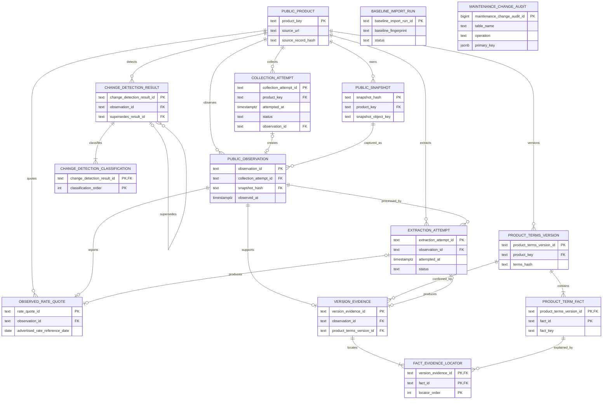

# 공개 상품 감사 저장 ERD

이 문서는 Flyway V1~V3를 사람이 빠르게 확인하기 위한 관계 요약입니다. 실제 column,
constraint, trigger와 index의 기준은
`apps/core-service/src/main/resources/db/migration`의 SQL입니다.

`baseline_import_run`은 bootstrap 실행 사건이고 업무 record와 직접 FK로 연결하지
않습니다. `maintenance_change_audit`은 승인된 break-glass 변경을 기록하는 별도 감사
원장이며 보호 대상 업무 테이블의 FK에 의존하지 않습니다.

V3 index는 조회 API의 시간축에 맞춰 다음 경로를 지원합니다.

- 상품별 최신 Observation: `product_key, observed_at, observation_id`
- Observation별 최신 ExtractionAttempt: `observation_id, attempted_at, extraction_attempt_id`
- 상품별 성공 추출: `product_key, attempted_at, extraction_attempt_id` partial index
- 상품별 최신 CollectionAttempt: `product_key, attempted_at, collection_attempt_id`
